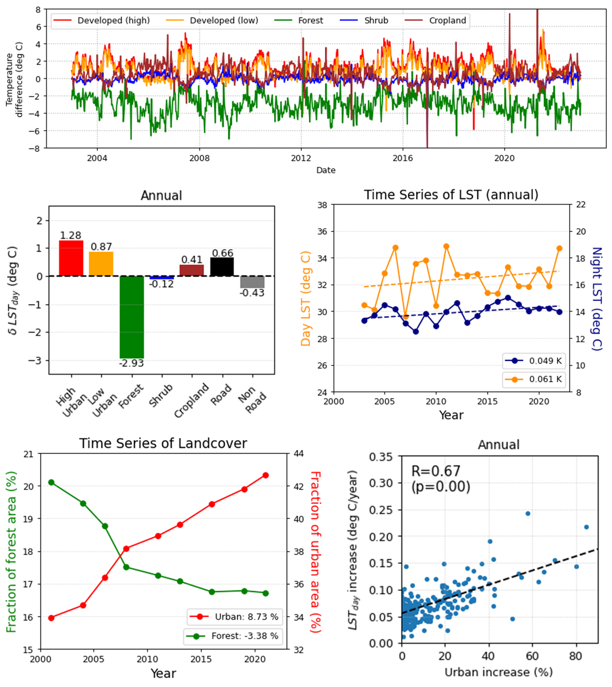

# Urban heat island in San Antonio, using GEE
This Python code is designed to monitor the urban heat island in San Antonio, Texas, using MODIS land surface temperature (LST) data via Google Earth Engine (GEE). You can do the following things by using (i) MODIS Aqua LST product (MYD11A2), (ii) USGS National Land Cover Database data, (iii) US census tract polygon data.
- Derive a 20-year time series of daytime and nighttime LST from 2002 to 2023
- Separate LST variations for different land cover types: urban, forest, crops, shrub, and wetland
- Find the correlation between urban area and the increase in temperature for each census tract

